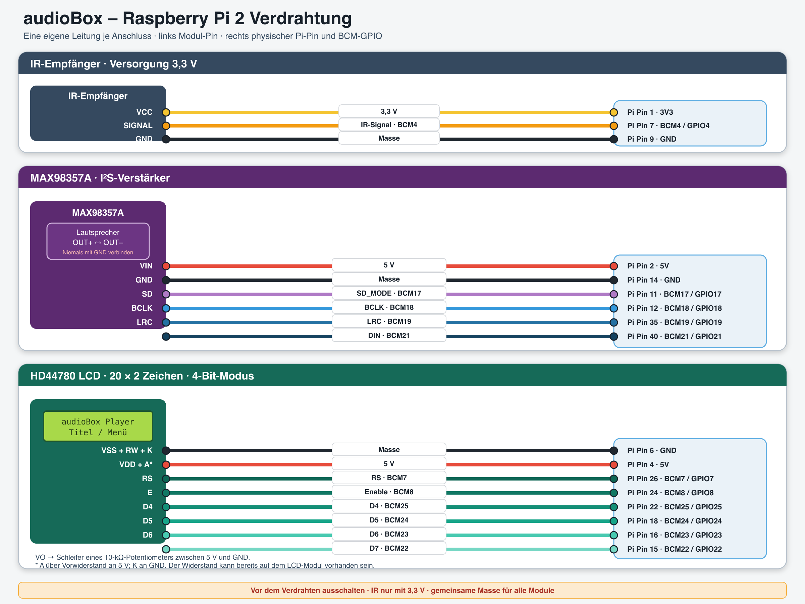

# audioBox für Raspberry Pi 2

Dieses Verzeichnis beschreibt das fertige **audioBox-Image**. Die audioBox ist
ein kompakter Netzwerk-Musikplayer für einen Raspberry Pi 2. Sie verbindet
Squeezelite mit einem Lyrion Media Server und unterstützt zusätzlich ein
HD44780-Display, eine Infrarot-Fernbedienung und einen MAX98357A-I2S-Verstärker.

## Funktionen

- Wiedergabe über einen Lyrion Media Server mit `squeezelite-ALCD`
- konfigurierbarer Playername und LMS-Server
- Audioausgabe über MAX98357A, HDMI oder Raspberry-Pi-Kopfhörerausgang
- Titel-, Menü- und Statusanzeige auf einem HD44780-LCD mit 20 x 2 Zeichen
- Bedienung mit einer weißen Apple-A1156-Infrarotfernbedienung
- HDMI-Startbildschirm mit AudioBox-Logo, Fortschrittsanzeige und IP-Adresse
- beschreibbare Konfiguration auf der FAT-Bootpartition
- Notfallkonsole auf `tty2`

Nach dem Einschalten werden Netzwerk, LIRC, LCDd und Squeezelite gestartet.
Währenddessen zeigt HDMI das AudioBox-Logo mit einem Fortschrittsbalken. Sobald
der Player bereit ist, verschwindet der Balken und die per DHCP vergebene
IPv4-Adresse wird angezeigt.

## Konfiguration

Alle Einstellungen des Players befinden sich auf dem laufenden Gerät in:

```text
/boot/audiobox.conf
```

Die Bootpartition ist beschreibbar. Das Root-Dateisystem bleibt dagegen
absichtlich nur lesbar. Die Konfigurationsdatei kann per SSH bearbeitet werden:

```sh
vi /boot/audiobox.conf
sync
/etc/init.d/S98lcdproc restart
/etc/init.d/S99squeezelite-alcd restart
```

Alternativ kann die audioBox nach dem Speichern neu gestartet werden.

Wichtige Standardwerte:

```text
AUDIOBOX_SPLASH_ENABLED=yes
AUDIOBOX_SPLASH_MESSAGE=audioBox wird gestartet ...
AUDIOBOX_SPLASH_INTERFACE=eth0

AUDIOBOX_LCD_ENABLED=yes
AUDIOBOX_LCDD_HOST=127.0.0.1
AUDIOBOX_LCD_WIDTH=20
AUDIOBOX_LCD_COMPAT=no
AUDIOBOX_TERMINAL_ENABLED=no

AUDIOBOX_LMS_HOST=lms.lan
AUDIOBOX_PLAYER_NAME=squeezelite-ALCD
AUDIOBOX_ALSA_DEVICE=plughw:CARD=MAX98357A,DEV=0
AUDIOBOX_EXTRA_ARGS=

AUDIOBOX_LIRC_ENABLED=yes
AUDIOBOX_LIRC_DRIVER=default
AUDIOBOX_LIRC_DEVICE=/dev/lirc0
AUDIOBOX_LIRCD_CONF=/boot/lircd.conf
AUDIOBOX_LIRCRC=/boot/lircrc

AUDIOBOX_LCDD_ENABLED=yes
AUDIOBOX_LCDD_DRIVER_PATH=/usr/lib/lcdproc/
AUDIOBOX_LCDD_DRIVER=hd44780
AUDIOBOX_LCDD_BIND=127.0.0.1
AUDIOBOX_LCDD_PORT=13666
AUDIOBOX_LCDD_REPORT_LEVEL=2
AUDIOBOX_LCDD_SERVER_SCREEN=blank
AUDIOBOX_LCDD_TITLE_SPEED=1
AUDIOBOX_LCDD_HELLO_LINE1=     Welcome to     
AUDIOBOX_LCDD_HELLO_LINE2=  audioBox Player  
AUDIOBOX_LCDD_GOODBYE_LINE1=                    
AUDIOBOX_LCDD_GOODBYE_LINE2=      Goodbye!      

AUDIOBOX_LCD_CONNECTION_TYPE=raspberrypi
AUDIOBOX_LCD_SIZE=20x2
AUDIOBOX_LCD_ENCODING=UTF-8
AUDIOBOX_LCD_CHARMAP=hd44780_euro
AUDIOBOX_LCD_PIN_RS=7
AUDIOBOX_LCD_PIN_E=8
AUDIOBOX_LCD_PIN_D4=25
AUDIOBOX_LCD_PIN_D5=24
AUDIOBOX_LCD_PIN_D6=23
AUDIOBOX_LCD_PIN_D7=22
```

Keine Leerzeichen um das Gleichheitszeichen einfügen. Leerzeichen innerhalb
der Begrüßungs- und Abschiedszeilen bleiben erhalten. Kommentare beginnen mit
`#`. Die LCD-Pinwerte sind **BCM-GPIO-Nummern**, nicht die Nummern der
physischen Stiftleiste.

### LMS und Playername

- `AUDIOBOX_LMS_HOST` legt den Lyrion Media Server fest. Ein leerer Wert
  aktiviert die automatische Serversuche.
- `AUDIOBOX_PLAYER_NAME` legt den im LMS sichtbaren Namen fest.
- `AUDIOBOX_EXTRA_ARGS` nimmt bei Bedarf weitere Squeezelite-Optionen auf.

### Audioausgang

Der MAX98357A ist als getesteter Standardausgang eingestellt:

```text
AUDIOBOX_ALSA_DEVICE=plughw:CARD=MAX98357A,DEV=0
```

Weitere mögliche Werte sind:

```text
default:CARD=MAX98357A
default:CARD=b1
default:CARD=Headphones
```

Die tatsächlich erkannten Ausgänge zeigt:

```sh
/etc/init.d/S99squeezelite-alcd stop
squeezelite -l
/etc/init.d/S99squeezelite-alcd start
```

Ein leerer Wert für `AUDIOBOX_ALSA_DEVICE` verwendet den Squeezelite-
Standardausgang.

## LCD

LCDd steuert ein HD44780-kompatibles Display mit 20 x 2 Zeichen an. Beim Start
werden zwei Begrüßungszeilen angezeigt. Danach übernimmt Squeezelite die
Anzeige von Titelinformationen, Lautstärke und Menüs.

Die erzeugte Laufzeitkonfiguration kann geprüft werden mit:

```sh
ps | grep '[L]CDd'
cat /run/LCDd.conf
/etc/init.d/S98lcdproc restart
```

LCDd bindet standardmäßig nur an `127.0.0.1:13666`.

## Infrarot-Fernbedienung

Die Standardkonfiguration ist für die weiße Apple-Fernbedienung A1156
vorgesehen. Die editierbaren Dateien befinden sich auf der Bootpartition:

```text
/boot/lircd.conf
/boot/lircrc
```

Tastenbelegung:

```text
Hoch        kurz: hoch; lang: Lautstärke erhöhen
Runter      kurz: runter; lang: Lautstärke verringern
Links       zurück
Rechts      rechts beziehungsweise vor
OK/Mitte    Auswahl bestätigen beziehungsweise wiedergeben
Menu        kurz: Pause/Wiedergabe; lang: Ein/Aus
```

Nach einer Änderung:

```sh
sync
/etc/init.d/S25lircd restart
/etc/init.d/S99squeezelite-alcd restart
```

Zur Diagnose stehen `mode2`, `irrecord` und `irw` zur Verfügung:

```sh
mode2 --device /dev/lirc0
irw
```

## Verdrahtung



Das Schaltbild liegt in diesem Verzeichnis zusätzlich als skalierbare
SVG-Datei vor:

```text
audiobox-wiring.png
audiobox-wiring.svg
```

Wichtige Anschlüsse:

- IR-Empfänger: 3,3 V an Pin 1, Signal an BCM4/Pin 7, Masse an Pin 9
- MAX98357A-SD: BCM17, physischer Pin 11
- MAX98357A-BCLK: BCM18, physischer Pin 12
- MAX98357A-LRC: BCM19, physischer Pin 35
- MAX98357A-DIN: BCM21, physischer Pin 40
- LCD-RS: BCM7, physischer Pin 26
- LCD-E: BCM8, physischer Pin 24
- LCD-D4: BCM25, physischer Pin 22
- LCD-D5: BCM24, physischer Pin 18
- LCD-D6: BCM23, physischer Pin 16
- LCD-D7: BCM22, physischer Pin 15
- alle Module müssen eine gemeinsame Masse verwenden

Der Lautsprecher wird ausschließlich zwischen `OUT+` und `OUT-` des
MAX98357A angeschlossen. Keiner der beiden Lautsprecherausgänge darf mit Masse
verbunden werden. Der IR-Empfänger wird mit **3,3 V**, nicht mit 5 V, versorgt.

## SSH und Notfallkonsole

Der SSH-Zugang erfolgt als `root` mit dem im Image hinterlegten Public Key:

```sh
ssh root@squeezelite-alcd-rpi2
```

Falls der Hostname nicht aufgelöst wird, kann die auf HDMI angezeigte
IP-Adresse verwendet werden. Passwortanmeldung ist deaktiviert.

Auf HDMI liegt der Startbildschirm auf `tty1`. Mit `Strg`+`Alt`+`F2` wird die
Notfallkonsole auf `tty2` geöffnet. Mit `Strg`+`Alt`+`F1` geht es zurück zum
Startbildschirm.

## Bekannte Einschränkung: analoger Kopfhörerausgang

Auf der getesteten Hardware erzeugt der analoge Raspberry-Pi-
Kopfhörerausgang ein dauerhaftes Grundrauschen. Das Rauschen blieb selbst nach
dem Abschalten der ALSA-Regler, dem Entfernen sämtlicher Soundkarten aus dem
laufenden System und dem Deaktivieren des MAX98357A bestehen. Es wird daher
nicht durch Squeezelite oder die Wahl von `AUDIOBOX_ALSA_DEVICE` verursacht.

Für eine hochwertige Wiedergabe werden der MAX98357A, HDMI oder ein externer
USB-/I2S-DAC empfohlen. Der Kopfhörerausgang bleibt für eine flexible
Umschaltung verfügbar, wird aber nicht als rauscharmer Ausgang zugesichert.

Den Kopfhörerregler zeigt bei Bedarf:

```sh
amixer -c Headphones sget PCM
```

## Kurze Fehlerdiagnose

```sh
mount | grep ' /boot '
ps | grep '[s]queezelite'
ps | grep '[L]CDd'
ps | grep '[l]ircd'
squeezelite -l
cat /run/LCDd.conf
```

Einzelne Dienste können ohne Neustart neu geladen werden:

```sh
/etc/init.d/S25lircd restart
/etc/init.d/S98lcdproc restart
/etc/init.d/S99squeezelite-alcd restart
```
